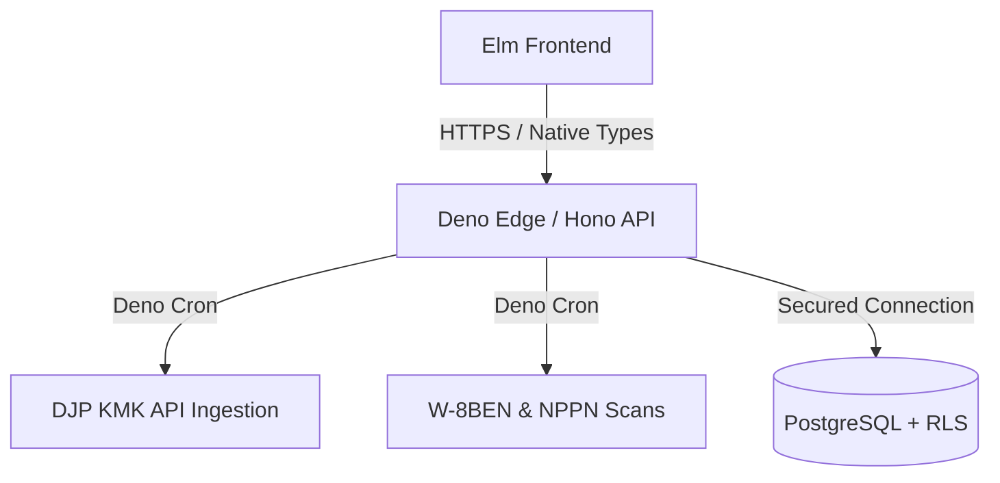

# remote-rupiah

**remote-rupiah** is a high-precision edge-native financial compliance engine designed for Indonesian remote professionals and digital nomads working with U.S. clients.

**remote-rupiah** automates the complexities of **UU HPP compliance**, **PPh 24 foreign tax credits**, and **KMK (Kurs Menteri Keuangan)** rate management while ensuring mathematical integrity through a strict **Zero-Float architecture**.

## Table of Contents

- [Strategic Value Proposition](#strategic-value-proposition)
- [Production-Grade Tech Stack](#production-grade-tech-stack)
- [Financial Integrity Protocols](#financial-integrity-protocols)
- [Security & Multi-Tenancy](#security--multi-tenancy)
- [Architecture Flow](#architecture-flow)
- [Local Setup & Development](#local-setup--development)
- [Testing Suite](#testing-suite)

## Strategic Value Proposition

- **The Compliance Engine:** Deep implementation of Indonesian Tax Law, specifically optimized for **KLU 62010 (Software Development)** with automated NPPN (Norma) calculations.
- **Evidence Locker & Monitoring:** Proactive compliance tracking for US-Indonesia Tax Treaty (W-8BEN) expiry dates, 1042-S document verification, and NPPN notification deadlines.
- **Architectural Integrity:** Leverages **Elm's** type system and **PostgreSQL RLS** to provide mathematical certainty and cryptographic data isolation.
- **Leak Detection:** Identifies hidden **monetary leaks** from FX spreads across platforms like Wise, Revolut, and PayPal.
- **DJP Coretax Ready:** Generates compliant export formats for the Indonesian tax portal via memory-safe CSV streams.

## Production-Grade Tech Stack

| Layer        | Technology     | Rationale                                                                                                                                |
| :----------- | :------------- | :--------------------------------------------------------------------------------------------------------------------------------------- |
| **Frontend** | **Elm 0.19.1** | Strong type system eliminates runtime exceptions. Relies entirely on custom vanilla CSS and inline SVGs with zero external UI frameworks |
| **Backend**  | **Deno 2.2+**  | Native TypeScript execution, built-in testing suite, and Deno Cron for edge-native scheduled tasks                                       |
| **Database** | **PostgreSQL** | Strict Row-Level Security (RLS) for immutable and database-level tenant isolation                                                        |
| **API**      | **Hono 4.x**   | Ultra-lightweight routing middleware optimized for edge-native deployment                                                                |

## Financial Integrity Protocols

We adhere to the **Zero-Float Protocol**:

1. **Strict Integer Math:** `Float` types are completely banned for currency calculations. All monetary balances are processed and stored as `BIGINT` representing cents in the database and handled via opaque integer types in Elm.
2. **UU HPP Compliance:** Automatic **50% NPPN** net income calculation for software development services under KLU 62010.
3. **PPh 24 "Lesser of" Rule:** Prevents double-taxation on US-source income by calculating the specific credit cap: `(ForeignNet / TotalTaxable) * TotalTaxDue`. Credits are strictly limited to zero if the associated Form 1042-S is unverified.
4. **KMK Automation:** Automated weekly fetch of official **Kurs Menteri Keuangan** rates via Deno Cron ensuring audit-compliant IDR conversion.
5. **Deterministic CSV Ingestion:** Automatically parses multi-currency CSV exports from Wise, Revolut, and PayPal, stream-parsing them directly into a unified `CanonicalTx` boundary format with deterministic ID generation.

## Security & Multi-Tenancy

- **Database-Level Isolation:** Tenant security is strictly enforced via **PostgreSQL RLS**. The database engine natively isolates tenant data to prevent cross-tenant leakage.
- **Route Protection:** All private backend endpoints are protected behind a JWT-based authentication middleware layer.
- **Logic Isolation:** All core tax formulas reside in Elm as pure, side-effect-free functions, ensuring they remain 100% testable and auditable.

## Architecture Flow



## Local Setup & Development

### Prerequisites

- **Deno 2.2+**
- **Elm 0.19.1**
- **PostgreSQL**

### Environment Setup

```bash
# Setup environment variables
cp .env.example .env

# KMK_ACCESS_TOKEN must be obtained from https://fiskal.kemenkeu.go.id

# Create database
createdb remote_rupiah

# Initialize database (Schema & RLS)
psql -d remote_rupiah -f db/schema.sql

# Seed with mock US 1042-S transaction data
psql -d remote_rupiah -f db/seed.sql
```

### Running the App

```bash
# Start Deno backend (Hono)
deno task dev

# In another terminal start Elm frontend
cd frontend && elm reactor
```

## Testing Suite

- **Frontend:** `elm-test` for all `TaxLogic`, `CsvMapper`, and `Money` modules.
- **Backend:** Deno built-in testing utilities for KMK ingestion, API routes, and core business rules.

```bash
# Run backend tests
deno test --allow-env --allow-net --allow-read --unstable-cron

# Run frontend tests
cd frontend && elm-test
```
