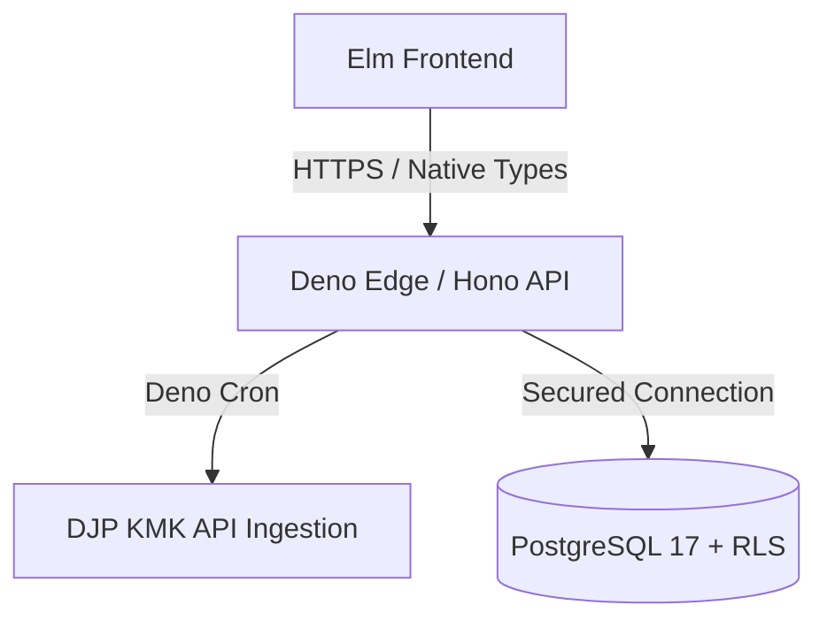

# remote-rupiah

**remote-rupiah** is a high-precision, edge-native financial compliance engine
designed for Indonesian remote professionals and digital nomads working with
U.S. clients.

remote-rupiah automates the complexities of **UU HPP compliance**, **PPh 24
foreign tax credits**, and **KMK (Kurs Menteri Keuangan)** rate management while
ensuring mathematical integrity through a strict **Zero-Float architecture**.

## Table of Contents

- [Strategic Value Proposition](#strategic-value-proposition)
- [Production-Grade Tech Stack](#production-grade-tech-stack)
- [Financial Integrity Protocols](#financial-integrity-protocols)
- [Security & Multi-Tenancy](#security--multi-tenancy)
- [Architecture Flow](#architecture-flow)
- [Agentic Governance](#agentic-governance)
- [Local Setup & Development](#local-setup--development)
- [Testing Suite](#testing-suite)

## Strategic Value Proposition

- **The Compliance Engine:** Deep implementation of Indonesian Tax Law,
  specifically optimized for **KLU 62010 (Software Development)** with automated
  NPPN (Norma) calculations.
- **Architectural Integrity:** Leverages **Elm's** type system and **PostgreSQL
  17 RLS** to provide mathematical certainty and cryptographic data isolation.
- **Leak Detection:** Identifies hidden **monetary leaks** from FX spreads
  across platforms like Wise, Revolut, and PayPal.
- **DJP Coretax Ready:** Generates compliant export formats for the Indonesian
  tax portal.

## Production-Grade Tech Stack

| Layer        | Technology        | Rationale                                                               |
| :----------- | :---------------- | :---------------------------------------------------------------------- |
| **Frontend** | **Elm 0.19.1**    | Opaque types eliminate floating-point errors in financial logic         |
| **Backend**  | **Deno 2.2+**     | Native JSR support and secure-by-default sandbox for edge deployment    |
| **Database** | **PostgreSQL 17** | Enterprise-tier Row-Level Security (RLS) for immutable tenant isolation |
| **API**      | **Hono 4.x**      | Ultra-lightweight middleware for Deno Deploy/Edge environments          |

## Financial Integrity Protocols

We adhere to the **Zero-Float Protocol**:

1. **Strict Integer Math:** `Float` is banned for currency. All values are
   `BIGINT` (cents) in the DB and opaque `Money` types in Elm.
2. **UU HPP Compliance:** Automatic **50% NPPN** application for software
   development services.
3. **PPh 24 "Lesser of" Rule:** Prevents double-taxation on US-source income by
   calculating the specific credit cap:
   `(ForeignNet / TotalTaxable) * TotalTaxDue`.
4. **KMK Automation:** Automated weekly fetch of official **Kurs Menteri
   Keuangan** rates via Deno Cron, ensuring audit-compliant IDR conversion.

## Security & Multi-Tenancy

- **Database-Level Isolation:** Tenant security is enforced via **PostgreSQL
  RLS**. App-level `WHERE user_id = ?` filters are redundant. The database
  itself prevents cross-tenant data leakage.
- **Logic Isolation:** All tax formulas reside in `frontend/src/TaxLogic.elm` as
  pure, side-effect-free functions.Making them 100% testable and auditable.

## Architecture Flow



## Agentic Governance

This codebase is optimized for AI-assisted development using the `.agents/`
framework:

- **Architecture Guards:** Linter-level enforcement of the Zero-Float policy.
- **Compliance Guards:** Codified Indonesian tax logic that prevents
  non-compliant code from being committed.
- **Automated Workflows:** Pre-commit protocols verifying financial precision
  and test coverage.

These are automated linting and static analysis rules codified to enforce
compliance. They are not an LLM prompt dump.

## Local Setup & Development

### Prerequisites

- **Deno 2.2+**
- **Elm 0.19.1**
- **PostgreSQL 17**

### Environment Setup

```bash
# Setup environment variables
cp .env.example .env

# Create database
createdb remote_rupiah

# Initialize database (Schema & RLS)
psql -d remote_rupiah -f db/schema.sql

# Seed with mock US 1042-S transaction data
psql -d remote_rupiah -f db/seed.sql
```

### Running the App

```bash
# Start Deno Backend (Hono)
deno task dev

# In another terminal, start Elm Frontend
cd frontend
elm reactor
```

## Testing Suite

- **Frontend:** `elm-test` for all `TaxLogic` and `Money` modules.
- **Backend:** Deno `std/assert` for KMK ingestion and API routes.

```bash
# Run backend tests
deno test --allow-net

# Run frontend tests
cd frontend && elm-test
```
