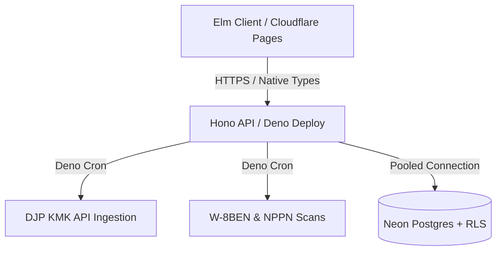

# remote-rupiah

**remote-rupiah** is a financial compliance engine designed for Indonesian Software Developers billing U.S. clients. The entire system is deployed edge-native for zero operational overhead.

**remote-rupiah** automates **UU HPP compliance**, **PPh 24 foreign tax credits**, and **KMK (Kurs Menteri Keuangan)** rate conversions using a strict **Zero-Float architecture**.

## Table of Contents

- [Strategic Value Proposition](#strategic-value-proposition)
- [Tech Stack](#tech-stack)
- [Financial Integrity Protocols](#financial-integrity-protocols)
- [Security & Multi-Tenancy](#security--multi-tenancy)
- [Architecture Flow](#architecture-flow)
- [Deployment & CI/CD](#deployment--cicd)
- [Project Status](#project-status)
- [Demo](#demo)
- [Local Setup & Development](#local-setup--development)
- [Testing Suite](#testing-suite)
- [License](#license)

## Strategic Value Proposition

- **Tax Engine:** Computes Indonesian tax law specifications for **KLU 62010 (Software Development)** with automated NPPN calculations.
- **Compliance Tracking:** Monitors US-Indonesia Tax Treaty (W-8BEN) expirations, Form 1042-S verifications, and NPPN notification states.
- **Architectural Safeguards:** Enforces absolute data isolation and compile-time correctness via Elm types and PostgreSQL RLS.
- **Leak Detection:** Surfaces hidden foreign exchange spread losses across Wise, Revolut, and PayPal.
- **DJP Coretax Ready:** Streams memory-safe CSV formats compliant with the Indonesian tax portal schemas.

## Tech Stack

| Layer        | Platform & Tooling                              | Rationale                                                                                     |
| :----------- | :---------------------------------------------- | :-------------------------------------------------------------------------------------------- |
| **Frontend** | **Elm 0.19.1** on **Cloudflare Pages**          | Eliminates client-side runtime crashes; served globally via edge CDN.                         |
| **Backend**  | **Deno 2.2+** + **Hono 4.x** on **Deno Deploy** | V8 isolate orchestration with zero warm-up latency and native `Deno.cron` support.            |
| **Database** | **PostgreSQL** via **Neon**                     | Serverless Postgres leveraging strict Row-Level Security (RLS) for absolute tenant isolation. |

### System Invariants

- **Zero Runtime Exceptions:** Elm architecture guarantees crash-free client execution.
- **Phantom Currency Safety:** Explicit types (`Money USD` vs `Money IDR`) prevent cross-currency operations at compile time.
- **Zero Server Management:** Serverless edge runtimes isolate scaling overhead from core engineering tasks.

## Financial Integrity Protocols

We adhere to the **Zero-Float Protocol**:

1. **Strict Integer Math:** `Float` types are banned. Balances are processed and stored as `BIGINT` (cents) in the database and handled via opaque arbitrary-precision integers (`BigInt`) in Elm.
2. **UU HPP Compliance:** Computes automatic **50% NPPN** net income deductions for software services under KLU 62010.
3. **PPh 24 Credit Cap:** Eliminates double-taxation on US-source income using the capping formula: `(ForeignNet / TotalTaxable) * TotalTaxDue`. Credits are restricted to zero if Form 1042-S is unverified.
4. **KMK Automation:** Orchestrates weekly fetch pipelines of official **Kurs Menteri Keuangan** rates via Deno Cron for audit-compliant IDR conversion.
5. **Deterministic Ingestion:** Streams multi-currency CSVs from Wise, Revolut, and PayPal directly into a unified `CanonicalTx` layout with deterministic ID generation.

## Security & Multi-Tenancy

- **Database-Level Isolation:** Data containment is enforced via native **PostgreSQL RLS** policies to eliminate cross-tenant leak vectors.
- **Route Protection:** Secures private backend endpoints behind JWT-based authentication middleware layers.
- **Logic Isolation:** Implements tax formulas as pure, side-effect-free functions in Elm, ensuring deterministic, auditable testing.

## Architecture Flow



## Deployment & CI/CD

Automated verification and deployment pipelines are driven via GitHub Actions (`.github/workflows/ci.yml`):

- **Continuous Integration (CI):** Executes parallel test jobs verifying Elm compilation optimizations, Deno lints, type checks, and randomized fuzz matrices on every push.
- **Continuous Deployment (CD):** Merges to `main` trigger atomic, zero-downtime updates directly to **Deno Deploy** and **Cloudflare Pages**.

## Project Status

Core engine is **75% complete and production-ready**. Development prioritizes domain mechanics, type safety, and total test coverage over visual polish to secure an immutable ledger foundation first.

### Complete Core (75%)

- **Calculation Invariants:** Compile-time blocks against floating-point drift and cross-currency mixing.
- **Domain Testing:** Property-based and boundary suites covering both client and server domains.
- **Ingestion Engine:** Async multi-currency stream-parsing into a unified schema.
- **Ingestion Boundary:** Multi-currency pipeline logic is fully validated via direct relational constraints. Native Wise/Revolut/PayPal/banks CSV mapping structures are currently decoupled and isolated to the active backlog.

### Active Backlog (25%)

- **CSV Mapping:** Deterministic boundary transformation of native Wise/Revolut/PayPal/banks exports.
- **DJP API Sync:** Migrating the KMK ingestion pipeline from local mocks to live integration test suites.
- **Notification Dispatchers:** Wiring cron events to outbound SMTP/Webhook alerts for expiring W-8BEN forms.

## Demo

- https://remote-rupiah.pages.dev/

## Local Setup & Development

### Prerequisites

- **Deno 2.2+**
- **Elm 0.19.1**
- **PostgreSQL 17** (Local engine & Neon branch)

### Environment Setup

```bash
# Setup environment variables
cp .env.example .env

# Create database
createdb remote_rupiah

# Apply the database tables
psql -h localhost -U YOUR_ACTUAL_DB_USER -d remote_rupiah -f db/schema.sql

# Seed the database with initial/mock data
psql -h localhost -U YOUR_ACTUAL_DB_USER -d remote_rupiah -f db/seed.sql
```

### Running the App

```bash
# Build the Elm production asset from the root
rm -rf frontend/elm-stuff
cd frontend && elm make src/Main.elm --output=../public/elm.js && cd ..

# Start Hono backend
# Listening on http://localhost:8000
deno task dev

# Start local static server for Elm frontend assets
# Listening on http://localhost:8010
deno run --allow-net --allow-read jsr:@std/http/file-server frontend --port=8010
```

## Testing Suite

Automated validation guarantees that underlying compliance formulas and structural rules remain sound during continuous refactoring cycles.

### Test Suite Breakdown

- **Property-Based Fuzz Testing (`TaxLogicFuzzTest.elm`):** Runs thousands of randomized numerical arrays through the tax bracket logic to assert structural integrity across wide ranges of currency value variations.
- **Boundary Validation (`PrecisionTest.elm`):** Validates extreme arbitrary precision edge-cases to guarantee zero rounding errors under the Zero-Float protocol.
- **Data Isolation Testing:** Validates PostgreSQL schema RLS definitions to ensure cross-tenant leakage is mathematically impossible at the database engine level.

### Execution

```bash
# Run backend tests
deno test --allow-env --allow-net --allow-read --unstable-cron

# Run frontend tests
cd frontend && elm-test
```

## License

This project is open-source and available under the terms of the [GNU General Public License v3.0 (GPL-3.0)](LICENSE).
