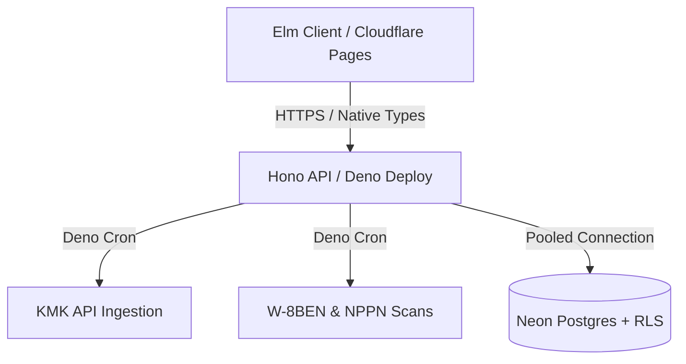

# remote-rupiah

**remote-rupiah** is a tax compliance engine designed for Indonesian Software Developers billing U.S. clients. The entire system is built edge-native to minimize operational overhead for solo and small teams.

The engine streamlines compliance with Indonesian tax laws (**UU HPP**), tracks foreign tax credits (**PPh 24**), and automates official **KMK (Kurs Menteri Keuangan)** rate conversions using a scalable fixed-point integer architecture.

## Table of Contents

- [Strategic Value Proposition](#strategic-value-proposition)
- [Tech Stack](#tech-stack)
- [Financial Integrity Protocols](#financial-integrity-protocols)
- [Security & Multi-Tenancy](#security--multi-tenancy)
- [Architecture Flow](#architecture-flow)
- [Deployment & CI/CD](#deployment--cicd)
- [Project Status](#project-status)
- [Demo](#demo)
- [Local Setup & Development](#local-setup--development)
- [Testing Suite](#testing-suite)
- [License](#license)

## Strategic Value Proposition

- **Tax Engine:** Computes Indonesian tax law specifications for **KLU 62010 (Software Development)** with automated NPPN net income deductions.
- **Architectural Safeguards:** Enforces strict multi-tenant data isolation and compile-time correctness via Elm types and PostgreSQL Row-Level Security (RLS).
- **DJP Coretax Ready:** Streams memory-safe CSV formats formatted to align with the Indonesian tax authority (DJP) portal schemas.

## Tech Stack

| Layer        | Platform & Tooling                              | Rationale                                                                                 |
| :----------- | :---------------------------------------------- | :---------------------------------------------------------------------------------------- |
| **Frontend** | **Elm 0.19.1** on **Cloudflare Pages**          | Eliminates client-side runtime crashes; functional, immutable architecture.               |
| **Backend**  | **Deno 2.2+** + **Hono 4.x** on **Deno Deploy** | Secure V8 isolate orchestration with zero warm-up latency and native `Deno.cron` support. |
| **Database** | **PostgreSQL 17** via **Neon**                  | Serverless Postgres leveraging strict RLS for multi-tenant isolation.                     |

### System Invariants

- **Zero Runtime Exceptions:** Elm architecture guarantees crash-free client execution.
- **Phantom Currency Safety:** Explicit types (`Money USD` vs `Money IDR`) prevent accidental cross-currency operations at compile time.
- **Zero Server Management:** Fully serverless edge runtimes isolate infrastructure scaling tasks from core development logic.

## Financial Integrity Protocols

1. **Strict Integer Math:** To eliminate IEEE 754 rounding errors, standard floating-point types are avoided for core financial computations. Balances are processed and stored as `BIGINT` (cents/minor units) in the database and handled via arbitrary-precision integers (`BigInt`) in Elm.
2. **UU HPP Compliance:** Computes automatic **50% NPPN** net income deductions for Software Engineering Services under Code KLU 62010.
3. **PPh 24 Credit Cap:** Helps calculate offsets for U.S.-sourced income tax tracking using the capping formula: `(ForeignNet / TotalTaxable) * TotalTaxDue`.
4. **KMK Automation:** Orchestrates a persistent background rate-synchronization daemon via `Deno.cron` to fetch weekly official **Kurs Menteri Keuangan** exchange rates.

## Security & Multi-Tenancy

- **Database-Level Isolation:** Data containment is strictly enforced via native **PostgreSQL RLS** policies to prevent cross-tenant leaks.
- **Route Protection:** Secures backend api endpoints behind middleware layers handling JWT-based token verification.
- **Logic Isolation:** Implements core tax formulas as pure, side-effect-free functions to simplify verification and testing.

## Architecture Flow



## Deployment & CI/CD

Automated verification and deployment pipelines are driven via GitHub Actions (`.github/workflows/ci.yml`):

- **Continuous Integration (CI):** Executes parallel test jobs verifying Elm compilation flags, Deno lints, type checks, and backend test suites on every push.
- **Continuous Deployment (CD):** Merges to the primary branch trigger atomic, zero-downtime updates directly to **Deno Deploy** and **Cloudflare Pages**.

## Project Status

The core financial framework is functional, focusing heavily on runtime type safety and strict ledger isolation over UI elements.

### Completed Core (~75%)

- **Calculation Invariants:** Compile-time validation blocking cross-currency blending and floating-point drift.
- **Database Architecture:** Relational schema deployment with active PostgreSQL RLS configuration.
- **KMK Ingestion Daemon:** Automated `Deno.cron` worker fetching and caching official minister of finance exchange rates.

### Active Backlog & Planned Features (~25%)

- **CSV Mapping Layer:** Deterministic parser mapping for native multi-currency statements from Wise, Revolut, and PayPal exports.
- **W-8BEN & 1042-S State Tracking:** Backend state machine to track US-Indonesia Tax Treaty documentation lifecycles, form expirations, and PPh 24 verification flags.
- **FX Spread Analytics:** Specialized ingestion telemetry to evaluate hidden spread overhead charges across different multi-wallet providers.

## Demo

- https://remote-rupiah.pages.dev/

## Local Setup & Development

### Prerequisites

- **Deno 2.2+**
- **Elm 0.19.1**
- **PostgreSQL 17**

### Environment Setup

```bash
# Setup environment variables
cp .env.example .env

# Create database
createdb remote_rupiah

# Apply the database tables
psql -h localhost -U YOUR_ACTUAL_DB_USER -d remote_rupiah -f db/schema.sql

# Seed the database with initial/mock data
psql -h localhost -U YOUR_ACTUAL_DB_USER -d remote_rupiah -f db/seed.sql
```

### Running the App

```bash
# Build the Elm production asset from the root
deno task build:frontend

# Start Hono backend
# Listening on http://localhost:8000
deno task serve:backend

# Start local static server for Elm frontend assets
# Listening on http://localhost:8010
deno task serve:frontend
```

## Testing Suite

Automated validation blocks regression drops across financial calculation components and user boundaries during refactoring.

### Test Suite Breakdown

- **Property-Based Fuzz Testing (`TaxLogicFuzzTest.elm`):** Runs thousands of randomized numerical arrays through the tax bracket logic to assert structural integrity across wide ranges of currency value variations.
- **Boundary Validation (`PrecisionTest.elm`):** Validates extreme arbitrary precision edge-cases to guarantee zero rounding errors under the Zero-Float protocol.
- **Data Isolation Testing:** Validates PostgreSQL schema RLS definitions to ensure cross-tenant leakage is mathematically impossible at the database engine level.

### Execution

```bash
# Run backend tests
deno task validate:backend

# Run frontend tests
deno task validate:frontend
```

## License

This project is open-source and available under the terms of the [GNU General Public License v3.0 (GPL-3.0)](LICENSE).
