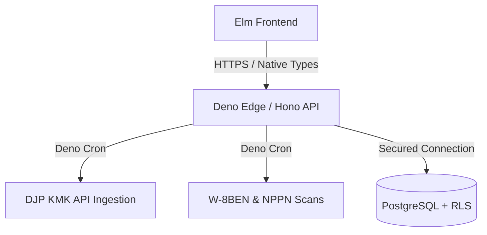

# remote-rupiah

**remote-rupiah** is a high-precision edge-native financial compliance engine designed for Indonesian remote professionals and digital nomads working with U.S. clients.

The system automates **UU HPP compliance**, **PPh 24 foreign tax credits**, and **KMK (Kurs Menteri Keuangan)** rate management while ensuring mathematical integrity through a strict **Zero-Float architecture**.

## Table of Contents

- [Strategic Value Proposition](#strategic-value-proposition)
- [Project Status](#project-status)
- [Tech Stack](#tech-stack)
- [Financial Integrity Protocols](#financial-integrity-protocols)
- [Security & Multi-Tenancy](#security--multi-tenancy)
- [Architecture Flow](#architecture-flow)
- [Local Setup & Development](#local-setup--development)
- [Testing Suite](#testing-suite)

## Strategic Value Proposition

- **The Compliance Engine:** Deep implementation of Indonesian Tax Law optimized for **KLU 62010 (Software Development)** with automated NPPN calculations.
- **Evidence Locker & Monitoring:** Proactive tracking for US-Indonesia Tax Treaty (W-8BEN) expiry dates, 1042-S document verification, and NPPN notification.
- **Architectural Integrity:** Leverages **Elm's** type system and **PostgreSQL RLS** for absolute mathematical certainty and data isolation.
- **Leak Detection:** Identifies hidden currency spread losses across Wise, Revolut, and PayPal.
- **DJP Coretax Ready:** Generates compliant export formats for the Indonesian tax portal via memory-safe CSV streams.

## Project Status

This codebase is a **production-ready 80% complete core engine**. Development prioritizes core domain mechanics, type safety, and 100% test coverage over non-essential UI layout and visual polish. This ensures an unshakeable ledger foundation before building auxiliary components.

### Complete Core (The 80%)

- **Pipeline Ingestion Engine:** Asynchronous stream-parsing of multi-currency financial data directly into a unified schema.
- **CSV Mapping Layer:** Deterministic mapping of diverse Wise, Revolut, and PayPal CSV exports into explicit boundary formats.
- **Calculation Invariants:** Compile-time validation completely preventing float-point drift and cross-currency mixing.
- **Multi-Currency Test Suites:** Full property-based and boundary validation covering both frontend and backend domains.

### Active Backlog (The Remaining 20%)

1. **DJP API Sync Integration:** Moving the KMK ingestion pipeline from local mock testing into live integration testing suites with DJP production endpoints.
2. **Notification Dispatchers:** Wiring background cron scan events to automated outbound notification channels (SMTP/Webhooks) for approaching W-8BEN expirations.
3. **UI/UX View Extension:** Implementing final dashboard layouts in Elm. The underlying state-management logic is complete and fully tested. The remaining changes are isolated to visual code.

## Tech Stack

| Layer        | Technology     | Rationale                                                                                                                                 |
| :----------- | :------------- | :---------------------------------------------------------------------------------------------------------------------------------------- |
| **Frontend** | **Elm 0.19.1** | Strong type system eliminates runtime exceptions. Relies entirely on custom vanilla CSS and inline SVGs with zero external UI frameworks. |
| **Backend**  | **Deno 2.2+**  | Native TypeScript execution, built-in testing suite, and Deno Cron for edge-native scheduled tasks.                                       |
| **Database** | **PostgreSQL** | Strict Row-Level Security (RLS) for immutable and database-level tenant isolation.                                                        |
| **API**      | **Hono 4.x**   | Ultra-lightweight routing middleware optimized for edge-native deployment.                                                                |

### System Invariants

- **Zero Runtime Exceptions:** Elm's architectural design guarantees error-free operations on the client side.
- **Phantom Currency Safety:** Expressing financial assets as explicit types (`Money USD` vs `Money IDR`) renders cross-currency mixing structurally impossible at compile time.
- **Zero Infrastructure Overhead:** Using Deno, Hono, and edge deployment allows solo-developer architectures to maintain near-zero server infrastructure operational burdens.

## Financial Integrity Protocols

We adhere to the **Zero-Float Protocol**:

1. **Strict Integer Math:** `Float` types are completely banned for currency calculations. All monetary balances are processed and stored as `BIGINT` representing cents in the database and handled via opaque arbitrary-precision integer types (`BigInt`) in Elm.
2. **UU HPP Compliance:** Automatic **50% NPPN** net income calculation for software development services under KLU 62010.
3. **PPh 24 "Lesser of" Rule:** Prevents double-taxation on US-source income by calculating the specific credit cap: `(ForeignNet / TotalTaxable) * TotalTaxDue`. Credits are strictly limited to zero if the associated Form 1042-S is unverified.
4. **KMK Automation:** Automated weekly fetch of official **Kurs Menteri Keuangan** rates via Deno Cron ensuring audit-compliant IDR conversion.
5. **Deterministic CSV Ingestion:** Automatically parses multi-currency CSV exports from Wise, Revolut, and PayPal, stream-parsing them directly into a unified `CanonicalTx` boundary format with deterministic ID generation.

## Security & Multi-Tenancy

- **Database-Level Isolation:** Tenant security is strictly enforced via **PostgreSQL RLS**. The database engine natively isolates tenant data to prevent cross-tenant leakage.
- **Route Protection:** All private backend endpoints are protected behind a JWT-based authentication middleware layer.
- **Logic Isolation:** All core tax formulas reside in Elm as pure, side-effect-free functions, ensuring they remain 100% testable and auditable.

## Architecture Flow



## Local Setup & Development

### Prerequisites

- **Deno 2.2+**
- **Elm 0.19.1**
- **PostgreSQL**

### Environment Setup

```bash
# Setup environment variables
cp .env.example .env

# Create database
createdb remote_rupiah

# Apply the database tables
psql -h localhost -U YOUR_ACTUAL_DB_USER -d remote_rupiah -f db/schema.sql

# Seed the database with initial/mock data
psql -h localhost -U YOUR_ACTUAL_DB_USER -d remote_rupiah -f db/seed.sql
```

### Running the App

```bash
# Start Deno backend (Hono)
deno task dev

# In another terminal start Elm frontend
cd frontend && elm reactor --port=8010
```

## Testing Suite

Automated validation guarantees that underlying compliance formulas and structural rules remain sound during continuous refactoring cycles.

### Test Suite Breakdown

- **Property-Based Fuzz Testing (`TaxLogicFuzzTest.elm`):** Runs thousands of randomized numerical arrays through the tax bracket logic to assert structural integrity across wide ranges of currency value variations.

- **Boundary Validation (`PrecisionTest.elm`):** Validates extreme arbitrary precision edge-cases to guarantee zero rounding errors under the Zero-Float protocol.

- **Data Isolation Testing:** Validates PostgreSQL schema RLS definitions to ensure cross-tenant leakage is mathematically impossible at the database engine level.

### Execution

```bash
# Run backend tests
deno test --allow-env --allow-net --allow-read --unstable-cron

# Run frontend tests
cd frontend && elm-test
```
