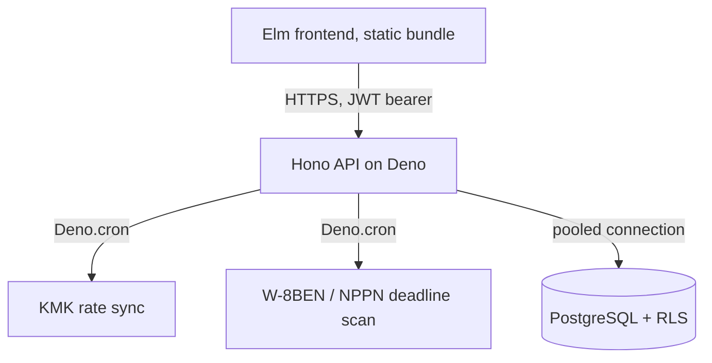

# remote-rupiah

[](https://github.com/gulfaniputra/remote-rupiah/actions/workflows/ci.yml)
[](LICENSE)


[](https://remote-rupiah.pages.dev/)

**remote-rupiah** is an edge-native tax compliance dashboard for Indonesian developers billing U.S. clients. It surfaces hidden FX spreads in USD->IDR transfers and computes **NPPN (Norma) net-income deductions** and **PPh 24 foreign tax credit** caps directly from transaction data with zero servers to manage.

**187 backend tests** (`Deno.test`) · **187 Elm tests + 31 property-based fuzz tests** on the tax/money logic.

> **Status:** Core tax/FX engine and db layer are functional and tested. Auth, CSV coverage, and deployment automation are partial. Refer to [Known Limitations](#known-limitations) before relying on this for a real filing.

## Table of Contents

- [Directory Structure](#directory-structure)
- [Tech Stack](#tech-stack)
- [Core Guarantees](#core-guarantees)
- [Tax & FX Logic](#tax--fx-logic)
- [Architecture](#architecture)
- [API Surface](#api-surface)
- [Known Limitations](#known-limitations)
- [Local Setup](#local-setup)
- [Testing](#testing)
- [License](#license)

## Directory Structure

```text
.
├── main.ts                 # Hono entry
├── deno.json               # Deno tasks + import map
│
├── routes/                 # Hono handlers (one file per resource)
│
├── services/                 # Core business logic (shared by routes & cron)
│   ├── tax_logic.ts          # TS mirror of TaxLogic.elm
│   ├── kmk*.ts               # Rate fetch/sync/backfill + Deno.cron scheduler
│   ├── compliance*.ts        # W-8BEN/1042-S status + deadline-scan cron (console-only)
│   ├── auth_middleware.ts    # JWT verification + dev-only token generator
│   ├── ingestion/            # Per-provider CSV parsers
│   └── wealth/               # FIFO lot accounting for unrealized FX gain
│
├── backend/src/              # Overlapping backend tree pending removal
│
├── db/
│   ├── schema.sql             # Current schema: tables + RLS policies
│   └── seed.sql               # Local dev seed data
│
├── frontend/
│   ├── index.html              # Static shell that loads elm.js
│   └── src/
│       ├── Main.elm             # App entry
│       ├── Money.elm            # Opaque BigInt Money type & USD/IDR phantoms
│       ├── TaxLogic.elm         # Pure NPPN/PPh24/bracket/FX-leak calculations
│       ├── Api.elm              # HTTP calls to the backend
│       ├── CsvMapper.elm        # Manual field-mapping UI
│       ├── Data/                # JSON decoders (one module per resource)
│       └── View/Dashboard.elm   # Main dashboard view
│
├── mocks/                    # Sample Wise CSVs for manual/demo testing
├── docs/spec.md              # Main feature/compliance specification
└── .github/workflows/ci.yml  # Lint + test on push/PR
```

## Tech Stack

| Layer        | Platform             | Notes                                                                     |
| ------------ | -------------------- | ------------------------------------------------------------------------- |
| **Frontend** | Elm 0.19.1           | Compiled to a static bundle & served from `frontend/`.                    |
| **Backend**  | Deno 2.2+ & Hono 4.4 | Single `main.ts` entry (JWT-protected routes & `Deno.cron` jobs).         |
| **Database** | PostgreSQL 17 & Neon | Row-Level Security (RLS) on every tenant table via `app.current_user_id`. |

## Core Guarantees

- **The Elm decoder is the only thing enforcing the money contract.** `Money.decoder` requires `amount_cents` to arrive as a numeric string and rejects anything else. Nothing on the TypeScript/Hono side stops a future route from returning a `number` instead of a string. If that ever happens, the Elm app fails the decode loudly instead of accepting corrupted money.
- **Phantom currency types.** `Money USD` and `Money IDR` are distinct types in Elm. Mixing them is a compile error and not a runtime bug.
- **RLS by default.** Every tenant table (`transactions`, `field_mappings`, `user_tax_profiles`, `compliance_documents`) enables RLS scoped to the authenticated user.

## Tax & FX Logic

All formulas live in `TaxLogic.elm` and are mirrored in `services/tax_logic.ts` for server-side use:

- **NPPN (KLU 62010):** Taxable income = `Gross_IDR × 0.50`.
- **2026 progressive brackets:** 5% (0–60M) · 15% (60M–250M) · 25% (250M–500M) · 30% (500M–5B) · 35% (>5B).
- **PPh 24 foreign tax credit cap:** `min(US tax paid, (ForeignNetIncome / TotalTaxableIncome) × TotalTaxDue)`. The credit is forced to zero unless the transaction's `is_1042s_verified` flag is set. An unverified 1042-S grants no credit.
- **KMK rate lookup:** Each transaction is matched to the KMK rate valid for its week (rates rotate every Wednesday); `services/kmk_cron.ts` syncs new rates on a schedule and backfills gaps.
- **FX leakage:** `(USD amount × mid-market rate) − actual IDR received` surfaced per-transaction and aggregated on the dashboard.

## Architecture



_Notes: CI (`.github/workflows/ci.yml`) runs on every push/PR to `main`: `deno lint` + `deno test -A` for the backend and `elm-test` + an optimized `elm make` build for the frontend._

## API Surface

All routes except `/`, `/health/kmk` and the dev-only auth token endpoint require a `Bearer` JWT.

| Route                                   | Purpose                                               |
| --------------------------------------- | ----------------------------------------------------- |
| `/api/transactions`                     | Transaction CRUD and KMK rate auto-attach on create   |
| `/api/v1/ingest`                        | CSV upload and auto-detection                         |
| `/api/v1/field-mapping`, `/api/csv/map` | Manual field mapping for unrecognized CSVs            |
| `/api/tax-profile`                      | NPWP/NIK/KLU profile                                  |
| `/api/forecast`                         | YTD totals, projected liability, and FX efficiency    |
| `/api/wealth`                           | FIFO-based unrealized gain on foreign-wallet balances |
| `/api/export`, `/api/export/djp`        | SPT and DJP Coretax-formatted CSV export              |
| `/api/compliance`                       | W-8BEN and 1042-S document status                     |
| `/health/kmk`                           | KMK sync heartbeat (healthy/stale/never_synced)       |

## Known Limitations

- **Auth is dev-only:** No login screen. Just `GET /api/auth/token` behind `ALLOW_DEV_AUTH`.
- **CSV auto-detection: Wise, Revolut, PayPal only:** Payoneer/BCA/Mandiri/BNI fall back to the manual field-mapper UI.
- **Compliance reminders log to console but not to user:** NPPN/W-8BEN cron jobs scan but don't email or push.
- **No CD automation:** CI validates but shipping to Deno Deploy & Cloudflare Pages is still manual.
- **Uneven TaxLogic.elm coverage:** Bracket/PPh24 math has fuzz tests. `calculateFXLeakage`, `calculateFinalPayable`, and `generateTaxReport` have only a couple of example-based tests each.
- **One float boundary:** `routes/forecast.ts` multiplies a `NUMERIC` KMK rate as a float before casting to `BIGINT` for FX-spread aggregation. The rest of the money path stays integer-only.

## Local Setup

**Prerequisites:** Deno 2.2+, Elm 0.19.1, and PostgreSQL 17.

```bash
cp .env.example .env
createdb remote_rupiah
psql -h localhost -U YOUR_DB_USER -d remote_rupiah -f db/schema.sql
psql -h localhost -U YOUR_DB_USER -d remote_rupiah -f db/seed.sql
deno task build:frontend   # Compiles frontend/src/Main.elm -> frontend/elm.js
deno task serve:backend    # http://localhost:8000
deno task serve:frontend   # http://localhost:8010
```

_Notes: Hit `GET /api/auth/token` to mint a dev JWT._

### Mock data

`mocks/wise-annual-{40k,80k}.csv` are ready-made Wise exports for exercising NPPN/YTD/final-payable without real transactions. No withholding column, so PPh 24 credit shows as zero. Re-uploading requires `DELETE FROM transactions;`.

## Testing

```bash
deno task validate:backend   # deno lint + deno test -A
deno task validate:frontend  # cd frontend && elm-test
```

- `TaxLogicFuzzTest.elm`: property-based tests over the bracket/NPPN/PPh24 math across randomized inputs.
- `PrecisionTest.elm`: boundary cases for the BigInt money path.
- RLS is exercised through backend integration tests rather than a dedicated Elm suite.

## License

[GNU GPL v3.0](LICENSE)
